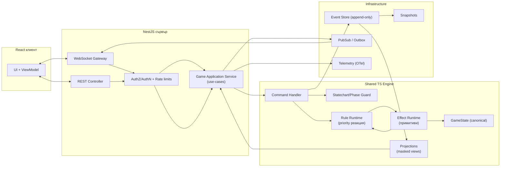
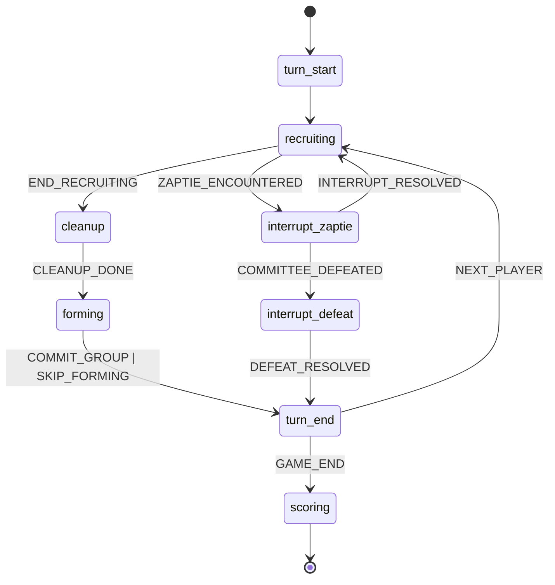
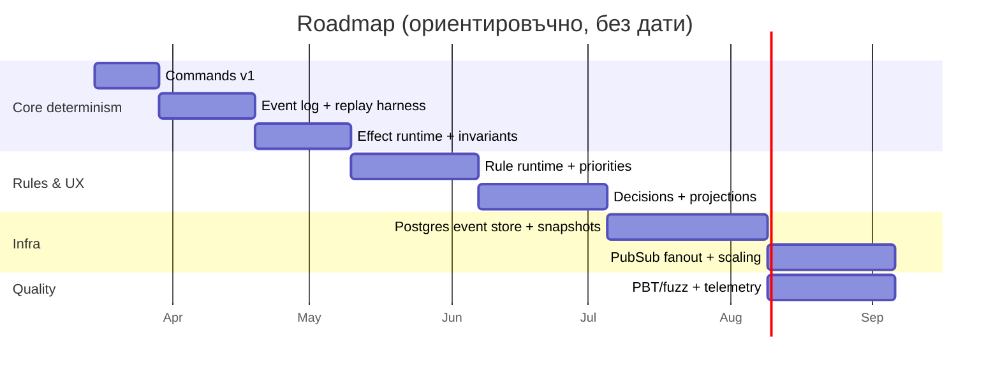

# Архитектура на детерминиран мултиплейър енджин за „Хайдути“ в NestJS/React

## Резюме за ръководството

Вие вече сте избрали архитектурна посока, която е много силна за настолна, ходова, мултиплейър игра: **команди (интент) → домейн събития (факти) → правила (реакции) → ефекти (примитиви)**, плюс **statechart/фазов модел** и **първокласни решения (decisions)**. Това ви дава две от най-важните свойства за онлайн настолни игри: **детерминизъм** и **пълна валидируемост на сървъра** (cheat prevention чрез авторитетен сървър). Логичното продължение е енджинът да стане **чиста (framework‑agnostic) домейн библиотека**, а NestJS/React да бъдат „адаптери“ около нея — в духа на Ports & Adapters (Hexagonal) и Clean Architecture, които изрично целят бизнес-логиката да е автономна, тестируема и независима от UI/DB/мрежа. citeturn10view3turn11view2

Силно препоръчвам да направите енджина **event-sourced** по подразбиране: всяка валидна команда да произвежда **append-only event log** (по gameId), от който може да се възстанови състояние, да се прави replay, детерминирани симулации, „replays“ за играчи, както и rollback/ресимулация при нужда. Това е класическият аргумент за event sourcing: всички промени се записват като последователност от събития и минали състояния могат да се реконструират чрез replay. citeturn10view1turn11view0turn14view1

За синхронизация онлайн: при turn-based настолна игра почти винаги най-добрият баланс е **авторитетен сървър** + **оптимистична конкуренция (expectedVersion)** + **идемпотентност на командите**. Клиентска „prediction“ може да се използва само за UX (например да се „заключи“ UI веднага), но реално състояние и скрити зони трябва да се променят *само* след сървърно потвърждение. Идеята за prediction/reconciliation изисква детерминизъм; тя е полезна като концептуален ориентир, но за вашия жанр ще я ползвате ограничено. citeturn12view1turn14view0

Ключовият „стоманен“ слой е **Effect runtime**: малък, затворен набор от примитиви (move/reveal/consumeAction/openDecision/advancePhase/…), които са единствената позволена форма за мутация на state. Ако дисциплинирате този слой (включително ред, атомарност, и валидиране на инварианти), ще получите енджин, който е мащабируем, лесен за fuzz/property-based тестове и стабилен за бъдещи разширения (нови карти, режими, AI, телеметрия). За property-based подход в JS/TS екосистема: fast-check е де факто стандарт, а идеята идва от QuickCheck (оригинален труд за property-based/рандомизирано тестване). citeturn4search1turn15view2

Накрая: приемам, че **лимити за конкурентни игри, брой едновременни зрители, целеви latency и SLA** не са уточнени; затова по-долу формулирам препоръки с „гъвкави“ параметри и изрично отбелязвам къде трябва да фиксирате числа (например max RTT, timeout-и, rate limits, размер на съобщения).  

(Правилата на „Хайдути“, които предоставихте, са основа за домейн модел и фазов statechart; използвам ги като домейн референция.) fileciteturn0file0

## Контекст, цели и ограничения

Играта „Хайдути“ е **ходова**, с **фази в хода**, **скрита информация (ръка)**, **публични зони (поле/използвани)**, **рандомизация (тесте/разбърквания)** и **прекъсващи ситуации** (типично: среща със „Заптие“), плюс опционален „паралелен“ режим. Това естествено води до нужда от: (а) строг фазов контрол (state machine/statechart), (б) детерминирана обработка на случайността, (в) ясна модель на „решенията“ (choice/decision) и (г) авторитетна валидност на сървъра. fileciteturn0file0

Архитектурните цели, които оптимизирате, са:

Детерминизъм и възпроизводимост. Един и същ начален state + една и съща последователност от команди трябва да дават идентичен event log и крайно състояние. Това е фундаментално за replay, дебъг, property-based тестове, и за всякаква reconciliation логика. citeturn10view1turn12view1

Тестируемост и изолация от инфраструктура. Домейн логиката (правила/ефекти) да се тества без реален DB, без мрежа, без React. Това следва директно от Clean Architecture (правилата да са независими от външни агенции) и Ports & Adapters (приложението да работи без UI/DB, с тестови адаптери). citeturn11view2turn10view3

Скалируемост и конкурентност. Системата да поддържа много паралелни „масички“ (games) чрез партициониране по gameId и „single-writer“ обработка на команди за всяка игра. За конкурентни updates имате два стандартни подхода: optimistic concurrency (expectedVersion) или кооперативно заключване (напр. advisory locks). citeturn14view0turn13view3

Устойчивост на latency и прекъсвания. WebSocket е естествен за интерактивни игри; протоколът е двупосочен върху един TCP канал, с origin-based security модел в браузъра. citeturn13view1

Сигурност и анти-чийт. За настолна игра основният „чийт“ е **изпращане на невалидни действия**, опити за **изтичане на скрита информация**, spam/DoS и replay на съобщения. OWASP препоръките за WebSockets включват лимити на payload, rate limiting, защити от replay и др. citeturn15view3turn13view2

Extensibility и hot-reload. Вие искате да можете да добавяте карти/правила/режими и да правите итерации бързо. NestJS има официална рецепта за hot reload с webpack HMR; това е отлично за dev, но за production „hot swap“ на домейн правила трябва да бъде версионирано и контролирано (по‑долу). citeturn16view3

## Целева архитектура на енджина

### Граници на модулите и Ports & Adapters подредба

Предлагам да мислите за енджина като *hexagonal domain kernel*, който няма директни зависимости към NestJS/React/DB/WS. NestJS и React са адаптери, които говорят с него през портове (интерфейси). Това следва класическата формулировка на Hexagonal Architecture: адаптерите превеждат външните събития към вътрешни повиквания и обратно, а приложението остава „невежо“ за технологията отвън. citeturn10view3

Същото е и „Dependency Rule“ на Clean Architecture: зависимостите сочат навътре, а форматите на външните кръгове не „изтичат“ навътре. Това е критично при вас, защото искате да не „вкарате“ WebSocket DTO-та или DB row структури в домейн слоя. citeturn11view2

**Препоръчани пакети/модули (монорепо или workspace):**

- `engine-core` (pure domain): state model, command types, event types, effect primitives, rule runtime, decision model, deterministic RNG abstraction, invariants.
- `engine-rules-hayduti`: дефиниции на карти + rule set (core turn rules + Дейци/Войводи като правила).
- `engine-projections`: read models / view builders (напр. per-player masked view, публичен feed, spectator view).
- `server-game-service`: NestJS application/service layer (auth, rate limit, command routing, persistence orchestration).
- `server-adapters`: WebSocket gateway + REST controllers.
- `infra-persistence`: event store, snapshot store, outbox/pubsub.
- `client-contract`: TS types + JSON Schema за wire протокола (версионирано).

### Концизна модулна диаграма



Архитектурният „трик“ тук е: **само `engine-core` има право да мутира `GameState`, и то само чрез `Effect Runtime`**. Всичко останало (NestJS, WS, DB) е периферия.

### Команди, събития, правила и ефекти като „четири слоя“

Вашият избор да разделите:

- **Command** = „интент“ (какво иска играчът),
- **DomainEvent** = факт (какво се е случило),
- **Rule** = реакция (когато X, направи Y),
- **Effect** = атомарна промяна/операция,

е много близък до практики от CQRS+Event Sourcing света: командите са write-интерфейсът, събитията са записът на истината, read моделите са projections. CQRS специално подчертава командите да са „бизнес задачи“ а не low-level updates, и разделя write/read модели. citeturn10view2

Event Sourcing дава формалната основа да пазите всички промени като събития и да правите rebuild, temporal queries и replay. citeturn10view1turn14view1

Практически препоръки за тези четири слоя:

Command слой. Командите трябва да са **валидни намерения**, но не и гарантирани за изпълнение. Те трябва да съдържат минимално нужното: target (коя карта/коя зона), параметър на избор (ако има), и метаданни за конкуренция/идемпотентност.

DomainEvent слой. Събитията трябва да са **неизменяеми (immutable)**, в минало време, и да са единственият начин да се обясни как state е стигнал дотук (Greg Young изрично описва events като „нещо, което се е случило в миналото“ и препоръчва verb‑past‑tense именуване). citeturn14view1  
Важно: събитията трябва да се проектират така, че да поддържат **скрита информация** (повече за това в секцията за модели и сериализация).

Rule слой. Правилото е „чиста“ реакция, която:
1) има стабилен `id` и `priority`,
2) има `when(ctx)` предикат върху (state, event, phase, pendingDecision),
3) връща списък от Effects (и евентуално отворени decisions).

Effect слой. Ефектите са малък набор примитиви, които са единствената мутация: move card между зони, reveal, consume action, forbid/allow forming, modify stat, enqueue event, open decision, replenish zone, advance phase и др. Никога не викате директно „методи“ по state обекти — само ефекти.

### Фазов модел като statechart (и защо това е правилно)

Statecharts са създадени точно за сложни реактивни системи; класическата формулировка описва разширения над обикновени state machines (йерархия, concurrency, комуникация). citeturn0search7  
SCXML е W3C стандарт, който комбинира Harel semantics с XML синтаксис, и дефинира събитийни преходи, условия (`cond`), `onentry/onexit` действия и пр. Това е много добра интелектуална рамка да валидирате вашия фазов модел, дори да не използвате директно SCXML като runtime. citeturn14view2

За TS екосистема, XState е популярна имплементация на state machines/statecharts, използва event-driven подход и actor модел. Може да я използвате директно или просто да следвате модела ѝ за дизайн. citeturn15view0

Минимален practical съвет: дори да не вземете готова библиотека, **опишете фазите като дискретно множество и централизирайте фазовите guards** (кои команди са позволени във всяка фаза + кои interrupts имат приоритет). Това елиминира „flag soup“ и зони на неяснота.



Това е концептуално; вашият „interrupt pipeline“ за „Заптие“ много естествено се моделира като вложено състояние / отделна sub-пътека.

### Първокласни Decisions и „one generic RESOLVE_DECISION“

Вашето решение да сведете „choose one“ механиките до типизирани `pendingDecision` payload-и е ключово за абстрактност и UI простота:

- UI не „гадае“ режим по trait флагове; UI рендерира по `pendingDecision` и `allowedOptions`.
- Сървърът валидира ownership чрез `ownerPlayerIndex`.
- Client action surface се свежда до малко Commands + един `RESOLVE_DECISION`.

Това е съвместимо с WebSocket security практики: валидирате входа структурно (schema), проверявате ownership и версии, и ограничавате възможните опции. OWASP (WebSocket Security Cheat Sheet) изрично препоръчва входна валидация, лимити и защита от replay. citeturn15view3

### TypeScript интерфейси и реализация на патърните

По-долу са примерни интерфейси, които директно имплементират командно‑събитийния pipeline, rule engine-а и effect runtime-а ви. Те са умишлено „framework-free“.

```ts
// engine-core/src/ids.ts
export type GameId = string & { readonly __brand: "GameId" };
export type PlayerId = string & { readonly __brand: "PlayerId" };
export type CommandId = string & { readonly __brand: "CommandId" };
export type EventId = string & { readonly __brand: "EventId" };

export type Revision = number & { readonly __brand: "Revision" }; // monotonic per game
```

```ts
// engine-core/src/command.ts
export type Command =
  | { type: "REVEAL_FIELD_CARD"; commandId: CommandId; playerId: PlayerId; fieldIndex: number; expectedRevision: Revision }
  | { type: "RECRUIT_VISIBLE"; commandId: CommandId; playerId: PlayerId; fieldIndex: number; expectedRevision: Revision }
  | { type: "RECRUIT_FROM_DECK"; commandId: CommandId; playerId: PlayerId; expectedRevision: Revision }
  | { type: "COMMIT_GROUP"; commandId: CommandId; playerId: PlayerId; group: GroupSpec; expectedRevision: Revision }
  | { type: "END_TURN"; commandId: CommandId; playerId: PlayerId; expectedRevision: Revision }
  | { type: "RESOLVE_DECISION"; commandId: CommandId; playerId: PlayerId; decisionId: string; optionId: string; expectedRevision: Revision };

export type CommandRejection =
  | { kind: "NOT_YOUR_TURN" }
  | { kind: "WRONG_PHASE"; phase: Phase }
  | { kind: "STALE_REVISION"; serverRevision: Revision }
  | { kind: "INVALID_TARGET"; reason: string }
  | { kind: "DECISION_NOT_OWNED" }
  | { kind: "RULE_VIOLATION"; ruleId: string; reason?: string };

export type ApplyResult =
  | { ok: true; newState: GameState; produced: DomainEvent[]; newRevision: Revision }
  | { ok: false; rejection: CommandRejection };
```

```ts
// engine-core/src/event.ts
export type DomainEvent =
  | { id: EventId; type: "TURN_STARTED"; playerId: PlayerId }
  | { id: EventId; type: "CARD_REVEALED"; fieldIndex: number; cardId: string }
  | { id: EventId; type: "CARD_MOVED"; cardId: string; from: ZoneRef; to: ZoneRef }
  | { id: EventId; type: "ZAPTIE_ENCOUNTERED"; source: "FIELD" | "DECK"; zaptieCardId: string }
  | { id: EventId; type: "COMMITTEE_REVEALED"; playerId: PlayerId }
  | { id: EventId; type: "COMMITTEE_DEFEATED"; playerId: PlayerId }
  | { id: EventId; type: "DECISION_OPENED"; decisionId: string; ownerPlayerId: PlayerId; payload: DecisionPayload }
  | { id: EventId; type: "DECISION_RESOLVED"; decisionId: string; ownerPlayerId: PlayerId; optionId: string }
  | { id: EventId; type: "PHASE_ADVANCED"; from: Phase; to: Phase }
  | { id: EventId; type: "GAME_ENDED" };
```

```ts
// engine-core/src/rule.ts
export interface RuleContext {
  readonly state: GameState;
  readonly phase: Phase;
  readonly event: DomainEvent;
}

export type Effect =
  | { type: "ENQUEUE_EVENT"; event: Omit<DomainEvent, "id"> }
  | { type: "MOVE_CARD"; cardId: string; from: ZoneRef; to: ZoneRef }
  | { type: "REVEAL_CARD"; zone: ZoneRef; cardId: string }
  | { type: "CONSUME_ACTION"; playerId: PlayerId; count: number }
  | { type: "FORBID_FORMING_THIS_TURN"; playerId: PlayerId; reasonRuleId: string }
  | { type: "MODIFY_STAT"; playerId: PlayerId; stat: "NABOR" | "DEINOST" | "BOINA_MOSHT"; delta: number }
  | { type: "SET_STAT"; playerId: PlayerId; stat: "NABOR" | "DEINOST" | "BOINA_MOSHT"; value: number }
  | { type: "OPEN_DECISION"; decisionId: string; ownerPlayerId: PlayerId; payload: DecisionPayload }
  | { type: "RESOLVE_DECISION"; decisionId: string; optionId: string }
  | { type: "ADVANCE_PHASE"; to: Phase }
  | { type: "REPLENISH_FIELD_TO_16" }
  | { type: "ASSERT_INVARIANT"; invariantId: string };

export interface Rule {
  readonly id: string;
  readonly priority: number; // lower = earlier, or vice versa - но да е фиксирано
  when(ctx: RuleContext): boolean;
  effects(ctx: RuleContext): readonly Effect[];
}
```

```ts
// engine-core/src/engine.ts
export interface GameEngine {
  apply(command: Command, state: GameState): ApplyResult;
}

// Minimal CQRS commitment: write-side returns events;
// read-side is handled via projections.
export interface EventStore {
  append(gameId: GameId, expectedRevision: Revision, events: DomainEvent[], commandId: CommandId): Promise<{ newRevision: Revision }>;
  load(gameId: GameId, fromRevision?: Revision): Promise<{ events: DomainEvent[]; headRevision: Revision }>;
}
```

Това е едновременно Command pattern (командите като обекти), Event Sourcing (append-only log), и CQRS (write-side produce events; read-side projections). citeturn10view1turn10view2turn14view1

#### Примерно правило: среща със „Заптие“ като interrupt pipeline

Псевдо-реализация, близка до вашите изисквания (официални приоритети, mutual exclusivity, и т.н.):

```ts
// engine-rules-hayduti/src/rules/zaptie_interrupt.ts
export const revealCommitteeOnZaptie: Rule = {
  id: "core.zaptie.reveal_committee",
  priority: 10,
  when: ({ event, state }) =>
    event.type === "ZAPTIE_ENCOUNTERED" &&
    state.committees[eventPlayer(state, event)].isSecret === true,
  effects: ({ event, state }) => {
    const playerId = eventPlayer(state, event);
    return [
      { type: "ENQUEUE_EVENT", event: { type: "COMMITTEE_REVEALED", playerId } },
      { type: "ADVANCE_PHASE", to: "interrupt.zaptie" },
    ];
  },
};
```

Критичният момент: **не „пишете“ директно `state.committees[player].isSecret=false`**, а го правите чрез ефект/събитие → така event log остава истината.

### Таблица: trade-offs на ключови патърни в тази архитектура

| Подход | Печелите | Плащате | Кога е най-добър fit |
|---|---|---|---|
| Event Sourcing (append-only events + replay) | Replay/rollback, audit, детерминирани симулации, лесен spectator/replay режим citeturn10view1turn14view1 | Сложност в проектиране на events, миграции/версиониране, нужда от snapshots при големи истории citeturn10view1 | Мултиплейър игри, където искате история, дебъг и авторитетност |
| CQRS (отделен write/read модел) | По‑чист write модел, оптимизирани projections за UI и spectator; независим scaling citeturn10view2 | Eventual consistency между write и read store; повече компоненти | Когато UI има различни гледни точки (играч/зрител/admin) |
| Statechart за фази/interrupts | Махате „flag soup“, формализирате allowed transitions; по‑лесна валидация citeturn14view2turn0search7 | Трябва дисциплина в моделирането; повече начална работа | Игри с прекъсвания (interrupts) и условни преходи |
| Rule/Effect runtime вместо „trait registry“ | Унифицирана логика за карти и core правила; data-driven разширяемост | Нужен е добър rule ordering/priority дизайн; debugging tooling | Много карти/умения и желание за hot-add/баланс |

## Синхронизация и онлайн игра

### Авторитетен сървър като „single source of truth“

За вашата игра най-рационалното е:

- Клиентът изпраща **команда (intent)**.
- Сървърът валидира (phase/turn/ownership/expectedRevision).
- Енджинът произвежда **събития + ново canonical състояние**.
- Сървърът записва събитията (event store) и broadcast‑ва **маскирани обновления** към съответните клиенти.

Това е същността на authoritative server: клиентът е „dumb“ по отношение на истината, но може да рендерира бързо. Концепцията за client-side prediction и reconciliation е полезна главно за „усещане“, ако latency е значим; тя предполага детерминизъм и sequence numbers. За turn-based UI често е достатъчно „оптимистичен UI“ (disable бутони, локален pending) вместо пълна state prediction. citeturn12view1

### Оптимистично срещу песимистично заключване на ходове

Имате два стабилни модела за конкурентни команди към една и съща игра:

**Оптимистичен модел (препоръчан по подразбиране).** Всяка команда носи `expectedRevision`; ако на сървъра `headRevision !== expectedRevision`, командата се отхвърля като stale и клиентът ресинхронизира. Това е класически optimistic concurrency: предполага се, че конфликтите са редки; редът се проверява при commit. citeturn14view0

**Песимистичен модел (single-writer lock).** Сървърът заключва gameId докато обработи командата. В разпределена среда това може да стане чрез advisory locks в PostgreSQL (session/transaction level) — официалната документация описва поведението и важни детайли (напр. session-level не следва transaction rollback semantics). citeturn13view3

В практиката: **комбинация** — optimistic на wire ниво (expectedRevision), плюс per-game сериализация в application service (queue/actor), е най-лесна за reasoning и има най-малко „странни“ race conditions.

### Реконсилиация и конфликтна резолюция

При вашия жанр, конфликтите са почти винаги „два клиента изпратиха команда върху стара ревизия“. Не ви трябва CRDT (той е за безкоординационни обновления и eventual convergence), защото при игри със скрита информация и строг ред на ходовете искате **една истина, един ред**. CRDT теорията е полезна като контраст (какво означава детерминирано convergence без координация), но тук ще усложни излишно. citeturn5search5turn5search2

Реалистичен конфликтен алгоритъм:

- Сървърът приема само команди от текущия `activePlayerId` (освен ако pendingDecision изисква от друг играч).
- Всяка команда е идемпотентна по `commandId`.
- При stale ревизия: връщате `STALE_REVISION` + последната маскирана view snapshot/revision, клиентът преизчислява UI.

### Таблица: стратегии за синхронизация (и къде стоят)

| Стратегия | Плюсове | Минуси | Подходящо за „Хайдути“ |
|---|---|---|---|
| Авторитетен сървър + събития (Event Sourcing) | Най-добър анти-чийт, лесни replays, прост конфликтен модел citeturn10view1turn13view1 | Изисква маскирани views за скрита информация | Да (препоръчано) |
| Lockstep (всички клиенти симулират) | Минимален сървър compute | Трудно със скрита информация; чийт риск; сложна надеждност | По-скоро не |
| P2P/hosted | Евтин backend | Сложна сигурност, NAT, доверие | Не |
| CRDT/eventual convergence | Офлайн/partition устойчивост citeturn5search5 | Не пасва на строг turn order и скрити карти | Не |

## Модели на данните, сериализация и API договори

### Каноничен GameState срещу „маскирани“ проекции

Каноничният state, който енджинът държи, вероятно ще съдържа:

- целия ред на тестето/използвани карти,
- ръце на играчите,
- pending decisions,
- пълна информация за това кои карти са „Заптие“ и т.н.

Но клиентът няма право да го вижда целия. Затова ви трябва отделен слой:

- `ProjectionBuilder.buildForPlayer(state, playerId)` → `PlayerViewState`
- `ProjectionBuilder.buildPublic(state)` → `PublicViewState`

Това е естествен CQRS projection модел. citeturn10view2

Ключово: **Domain events и persistence могат да съдържат чувствителни данни**, но wire събитията към клиенти трябва да са филтрирани/преобразувани.

### Формати за сериализация: JSON първо, но с дизайн за еволюция

За web клиенти JSON е безспорен baseline: JSON е стандартизиран като лек, текстов, езиково-независим interchange формат. citeturn13view0

Препоръчвам:

- **Wire протокол v1**: JSON съобщения с ясни дискримиантори (`type`) и версия (`schemaVersion`).
- **Валидация**: JSON Schema (draft 2020‑12) за вход/изход на WebSocket/REST payload-ите; официалният draft 2020‑12 е публикуван и широко поддържан. citeturn15view1
- **Опция за бъдеще**: ако започнете да имате много трафик или искате бинарен протокол, CBOR е IETF стандарт с цели: малък код, малък message size и extensibility без version negotiation. citeturn12view3

#### Таблица: JSON vs CBOR vs Protobuf vs MessagePack (за вашия случай)

| Формат | Силни страни | Рискове/цена | Кога да го изберете |
|---|---|---|---|
| JSON | Най‑лесно за debug, web-native, стандарт (RFC 8259) citeturn13view0 | По-големи payload-и | Начало + dev velocity |
| CBOR | Стандарт (RFC 8949), по‑компактен, extensible citeturn12view3 | Не е human-readable; tooling | Ако WS трафикът стане значим |
| Protobuf | Строг schema-first, ефективен | Codegen pipeline, web tooling | Ако имате много услуги/езици |
| MessagePack | Компактен, широко ползван | Каноникализация/варианти на енкодинг | Ако искате бърз binary без full protobuf stack citeturn2search3 |

### REST и WebSocket договори (message schemas)

WebSocket протоколът е стандартизиран (RFC 6455) и е предназначен за двупосочна комуникация без polling; има origin-based security модел и handshake + framing. citeturn13view1  
NestJS има официални WebSocket gateways и поддържа `ws` и `socket.io` чрез адаптери; gateways са providers и могат да ползват DI. citeturn11view3turn1search1

#### Препоръчан wire модел (минимален)

**REST (извън реалното време):**
- `POST /games` → създава игра, връща `gameId`, initial `revision`.
- `POST /games/{gameId}/join` → join token / seat.
- `GET /games/{gameId}/view` → snapshot view за играч/зрител.
- `GET /games/{gameId}/events?from=rev` → re-sync за клиенти (ако WS пропусне).

**WebSocket (реално време):**
- `CLIENT_COMMAND` (command payload)
- `SERVER_ACK` (accepted/rejected + serverRevision)
- `SERVER_EVENT_BATCH` (маскирани event-и за този клиент)
- `SERVER_VIEW_PATCH` (опционално: patch/diff ако предпочетете)

Примерни TS типове за протокола:

```ts
// client-contract/src/ws.ts
export type WsClientMsg =
  | { type: "CLIENT_COMMAND"; gameId: string; command: Command }
  | { type: "PING"; t: number };

export type WsServerMsg =
  | { type: "SERVER_ACK"; commandId: string; ok: true; newRevision: number }
  | { type: "SERVER_ACK"; commandId: string; ok: false; rejection: CommandRejection; serverRevision: number }
  | { type: "SERVER_EVENT_BATCH"; gameId: string; fromRevision: number; toRevision: number; events: MaskedEvent[] }
  | { type: "SERVER_VIEW_SNAPSHOT"; gameId: string; revision: number; view: PlayerViewState };
```

Практически детайл: ако използвате Socket.IO, acknowledgements са вградени; Socket.IO документацията описва request/response ack механика и broadcast с ack. citeturn9search7turn9search3  
Ако използвате чист `ws`, ще си направите ack protocol сами (което е напълно ok, и често по‑леко).

## Тестова стратегия, replay/rollback, наблюдаемост и сигурност

### Тестови пирамиди за енджин, който е детерминиран

Най-голямата печалба от вашия дизайн е, че енджинът може да се тества като чиста функция на входен log.

**Unit тестове (най-много на брой):**  
Тествайте правило по правило и ефект по ефект. Това е лесно, защото Rule е чиста реакция върху (state,event), а Effect runtime е малък и може да се покрие с exhaustive тестове на примитивите.

**Integration тестове:**  
Дайте начален state + команда последователност → проверете event log (и финален state). Event sourcing подходът естествено ви позволява „golden tests“: известни партийни сценарии от правилника. citeturn10view1turn14view1

**Property-based / generative тестове:**  
Идеята на QuickCheck е да формулирате свойства (invariants) и да ги тествате върху много случайни входове; paper-ът подчертава, че чистите функции са особено подходящи за автоматизирано тестване. citeturn15view2  
В JS/TS fast-check е фреймуърк за property-based тестване. citeturn4search1

Типични invariants за вашия енджин:

- Няма „Заптие“ в ръката (ако правилата го забраняват; за вас това е домейн-инвариант). fileciteturn0file0  
- Брой карти на полето ≥ 16 в края на ход, освен ако играта приключва (по правилник). fileciteturn0file0  
- `revision` расте монотонно и event id/command id са уникални.
- Маскираните views никога не съдържат чужда ръка/скрито тесте.
- При replay на event log получавате същия state (детерминизъм).

**Fuzzing на входа (security + robustness):**  
Тествайте JSON Schema валидатора/десериализацията, лимити на размер, непознати полета, replay атаки (повторение на стар commandId), и др. OWASP за WebSockets дава конкретни насоки: лимитиране на message size, rate limits и replay protections (nonce/timestamp). citeturn15view3

### Replay/rollback като продуктова и инженерна функция

Event sourcing естествено поддържа:

- Реplay за „replay viewer“ и за дебъг.
- Възстановяване на state след crash (rebuild).
- Potential rollback чрез „recompute from snapshot + replay“, ако ви се наложи (например при корекция на event). Fowler описва temporal query и event replay като базови възможности. citeturn10view1

Практически: добавете snapshots на всеки N events или при phase boundary (end of turn), за да не replay-вате хиляди събития при всяко включване на зрител. Fowler описва и идеята за snapshots за performance. citeturn10view1

### Телеметрия и наблюдаемост

В turn-based игра latency е по‑толерантен, но **консистентността** и **диагностиката** са критични. Предлагам:

- Trace на `SubmitCommand` → `Validate` → `Apply` → `Persist` → `Broadcast`.
- Metrics: p95 apply time, reject rate по `kind`, ws drops, resync count.
- Structured logs: event ids, gameId, revision, rule ids fired.

OpenTelemetry има спецификация за traces/metrics/logs и общи принципи за устойчиви telemetry системи. citeturn14view3turn7search7

### Сигурност: cheat prevention и защита на инфраструктурата

**Авторитетност и валидация.** Командите се валидират изцяло на сървъра: правилна фаза, правилен играч, валидни targets, валидни decision опции. Клиентът е удобство, не доверен фактор.

**WebSocket специфики.** OWASP препоръчва:
- лимит на payload (напр. 64KB),
- rate limiting (напр. стартово 100 msg/min е „common starting point“),
- защита от message flooding/backpressure,
- защити от replay (nonce/timestamp),
- да не се ползва `eval` за JSON. citeturn15view3

**Rate limiting и DoS.** OWASP API Security и cheat sheets подчертават липсата на rate limiting като риск; REST security cheat sheet изрично използва 429 за rate limiting. citeturn16view0turn13view2

**AuthN/AuthZ.** Ако ползвате JWT, RFC 7519 дефинира JWT като компактен, URL-safe claims формат (подпис/интегритет и/или криптиране чрез JWS/JWE). citeturn16view2  
Практически: отделете `playerId` (домейн) от `accountId` (auth), и винаги мапвайте seat/role per game.

**Скрита информация.** Най-честата грешка при дигитализация на настолни игри е „изтичане“ на deck/ръце чрез:
- общ broadcast на canonical state,
- прекалено подробни domain events към всички,
- или debug endpoints без auth.

Затова projections трябва да са част от архитектурата, не afterthought.

## Деплоймънт, мащабиране и план за миграция

### Stateless scaling, WebSockets и routing

WebSockets са дълги, stateful конекции; scaling изисква стратегия:

- Ако държите WS connections в даден pod/инстанс, ще имате нужда от **room fanout** (pubsub) или sticky sessions.
- Redis Pub/Sub е лесен за fanout, но има **at-most-once delivery semantics** (съобщение може да се загуби при disconnect). Това е приемливо, ако клиентите могат да се ресинхронизират чрез REST `GET /events?from=` или snapshot. citeturn8search1
- Ако искате по-надежден messaging, NestJS описва NATS транспорт; NATS поддържа at-most-once и at-least-once (в зависимост от режима), което може да е по‑подходящо за outbox/event distribution между pods. citeturn8search3

Съвет: за начало, Redis Pub/Sub + re-sync endpoint е достатъчен; при растеж мигрирате към по-надежден bus (NATS JetStream/Kafka), без да пипате `engine-core`.

### Шардинг и „single writer per game“

Най-устойчивият scaling модел е:

- Партиционирате по `gameId` (consistent hashing).
- Всяка команда за даден gameId се обработва сериализирано.
- Persistence гарантира инкрементална ревизия.

Две практични реализации:

1) **Optimistic concurrency** в event store (unique constraint on `(gameId, revision)` или `(gameId, expectedRevision)`), която отхвърля паралелни commits. citeturn14view0  
2) **PostgreSQL advisory lock** върху `hash(gameId)`, взет transaction-level за кратко около append операцията. PostgreSQL док описва именно transaction-level locks като удобни за краткотрайно заключване. citeturn13view3

### Hot-reload и версиониране на правилата

NestJS HMR помага за dev итерация (по-бързо bootstrapping). citeturn16view3  
Но за домейн правила „hot reload“ в production трябва да означава:

- всяка игра има `rulesetVersion` (фиксиран при създаване),
- event log пази `engineVersion`/`rulesetVersion`,
- при промяна на правила старите игри продължават на стара версия, докато новите се създават на новата.

Иначе risk-вате replay на стари игри да стане недетерминиран.

### Миграционен план за refactor на съществуващия shared engine

Давам поетапен план „без big bang“, защото вече имате работеща система.

**Етап 1 (малък): Въвеждане на команден слой и идемпотентност**
- Дефинирайте новия surface: Commands + RESOLVE_DECISION.
- Добавете `commandId`, `expectedRevision`, `playerId` навсякъде.
- На сървъра: dedupe store по `(gameId, commandId)`.

**Етап 2 (малък–среден): Event log като истина**
- Въведете DomainEvent модел и append-only запис (дори първо в памет/файл).
- Направете `apply(command, state) -> events + state'`.
- Добавете replay harness.

**Етап 3 (среден): Effect runtime като единствена мутация**
- Изолирайте всички state mutations в `applyEffect(effect, state)`.
- Добавете инвариантни ASSERT ефекти за ранно хващане на бъгове.

**Етап 4 (среден): Rule runtime и миграция от trait registry**
- Пренапишете core turn rules като Rules.
- Пренесете Дейци/Войводи като rule specs или rule references от card defs.
- Вкарайте scoring в същия pipeline (както сте планирали).

**Етап 5 (среден): Projections и скрита информация**
- Вкарайте `PlayerViewState` и маскиране.
- Превключете клиента да рендерира по view state, не по ad-hoc флагове.

**Етап 6 (среден–голям): Persistence (Postgres), snapshots, resync**
- Event store таблица + snapshot таблица.
- REST endpoints за snapshot/events resync.
- PubSub за WS fanout.

**Етап 7 (голям): Property-based/Fuzz + Telemetry**
- fast-check генератори за командни последователности.
- OTel traces/metrics/logs за командния pipeline. citeturn4search1turn14view3

### Приоритизиран roadmap с effort ranges

| Милеcтоун | Какво доставяте | Основен риск, който сваляте | Effort |
|---|---|---|---|
| Engine command surface v1 | Commands + RESOLVE_DECISION + expectedRevision | Невалидни действия/чийт, неясни UI режими | Small |
| Event log + replay harness | Append-only domain events + replay test | Детерминизъм, дебъг, бъдещ replay продукт | Medium |
| Effect runtime + invariants | Единствена мутация + ASSERT | „Скрити“ бъгове и state corruption | Medium |
| Rule runtime + приоритети | Единен механизъм за core + карти | Trait spaghetti, трудно разширяване | Medium |
| Projections (player/public) | Маскиране на скрита инфо, spectator view | Изтичане на карти/тесте | Medium |
| Persistence + snapshots | Postgres event store + snapshots + resync | Загуба на WS съобщения, рестарти | Medium–Large |
| Scaling + pubsub | Redis/NATS fanout + multi-pod | Реално мащабиране на WS | Medium–Large |
| Full PBT/fuzz + OTel | fast-check + telemetry dashboards | Регресии, performance, наблюдаемост | Medium |

Като визуален план (ориентировъчен):



(Датите са само примерна подредба; реалните зависят от екип/контекст.)

---

Бележка: В изложението използвах официалните правила, които предоставихте, като домейн основа за фазовия модел, зони/скрита информация и interrupt логика. fileciteturn0file0